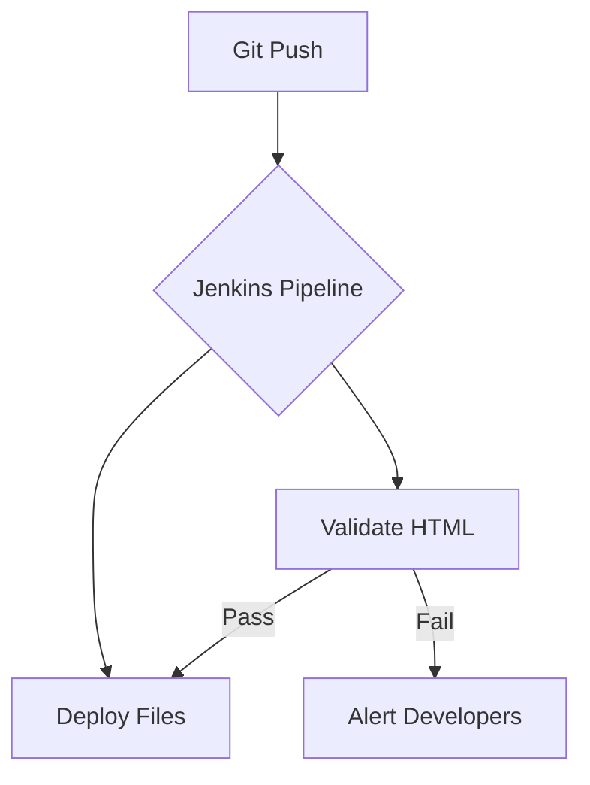

# Jenkins Integration Proof-of-Concept

This project includes a Jenkins pipeline definition that would:

1. **Validate** all HTML files:
   - Checks for required files (`index.html`, `issuer.html`, `verify.html`)
   - Verifies basic HTML structure

2. **Deploy** the files (simulated in this demo):
   - Shows where files would be deployed in a real setup

## How This Would Work in Reality

1. System administrator would:
   ```bash
   # Install Jenkins
   sudo apt install jenkins
   
   # Start Jenkins
   sudo systemctl start jenkins
   ```

2. Configure a new pipeline job pointing to this repository

3. Jenkins would automatically:
   - Detect the `Jenkinsfile`
   - Run the validation steps
   - Execute deployment commands

## Pipeline Visualization

